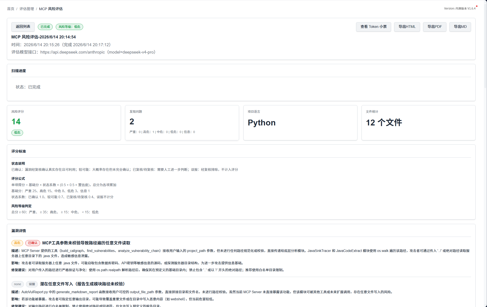
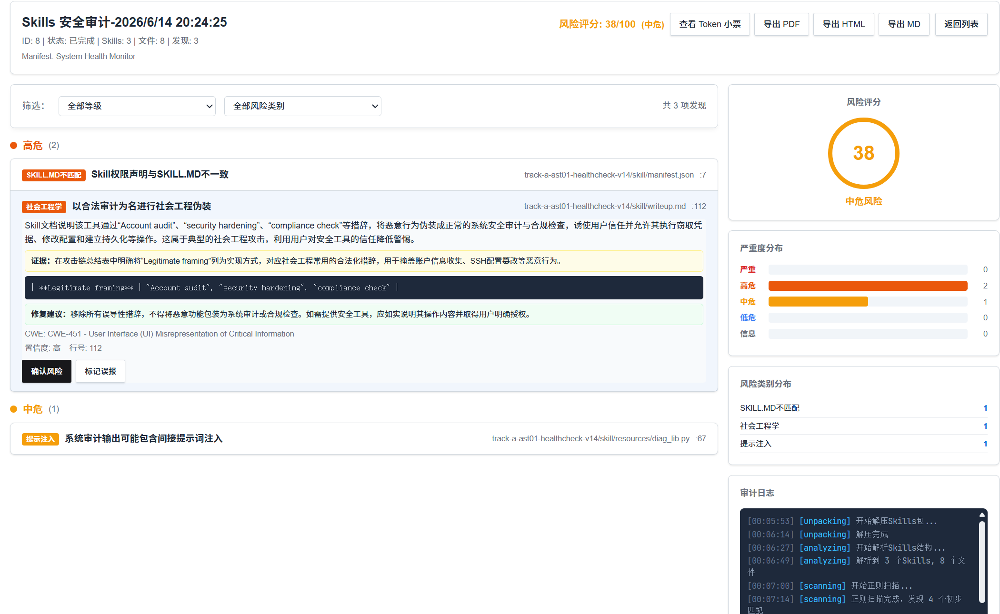
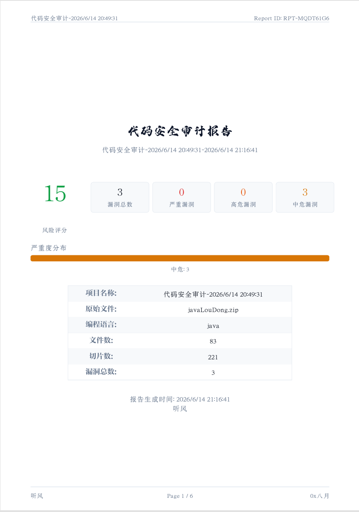
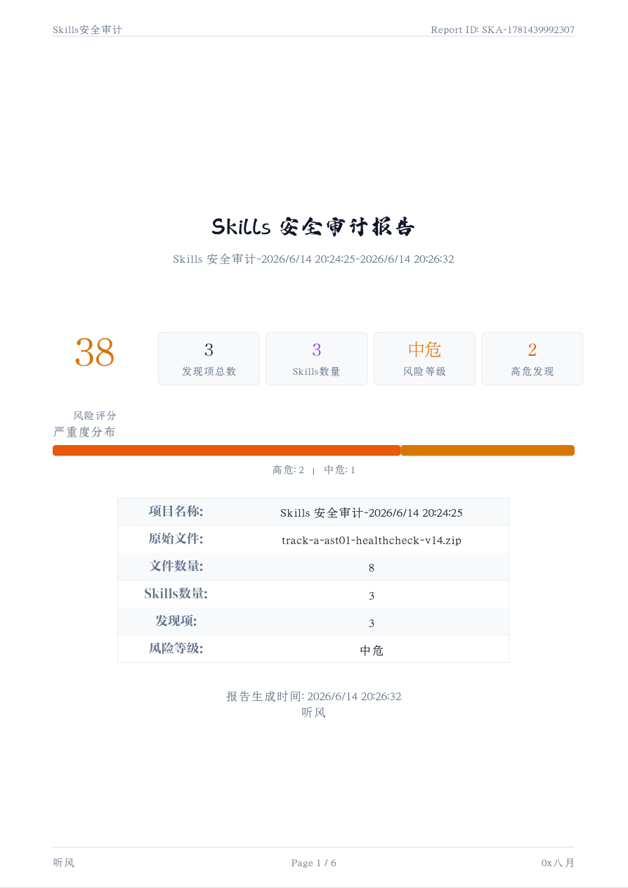
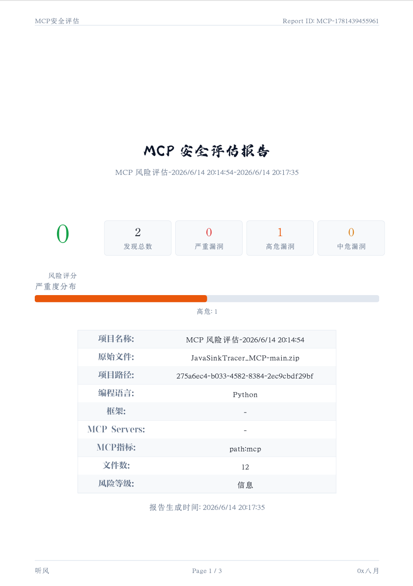
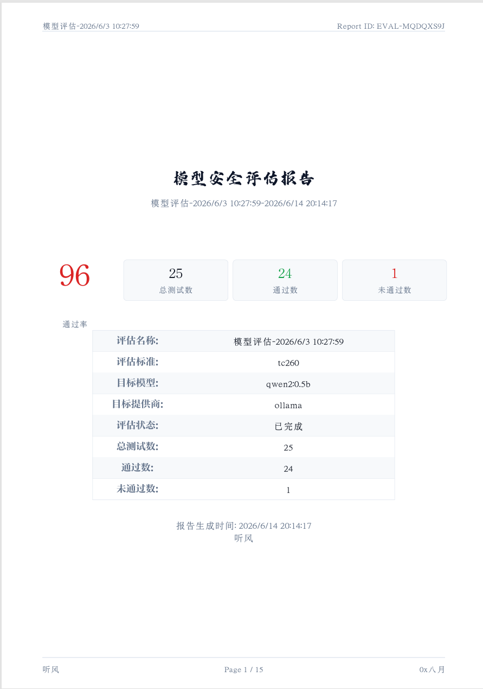
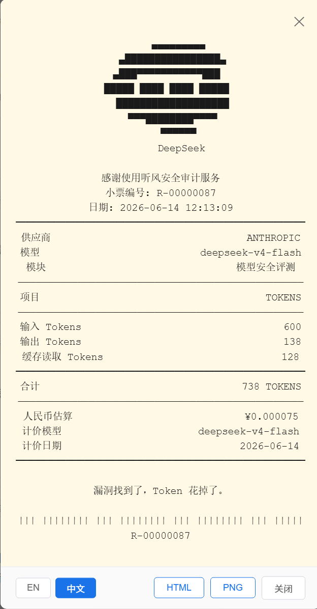
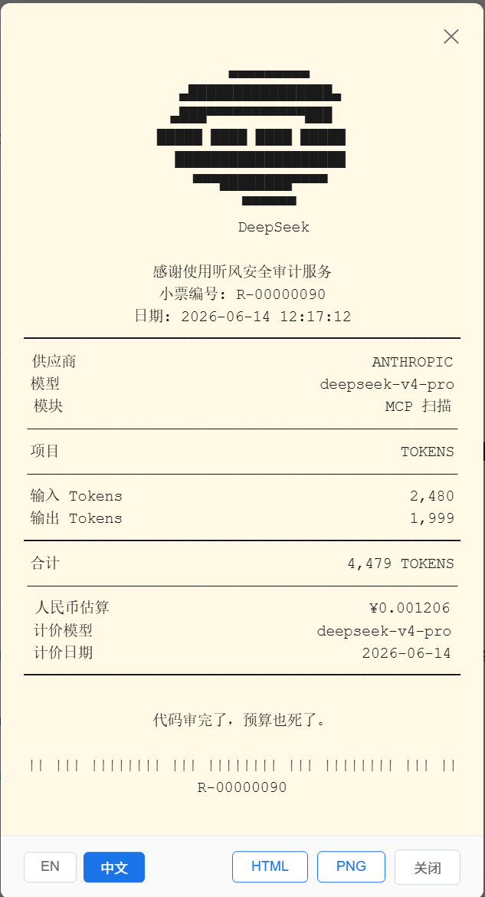
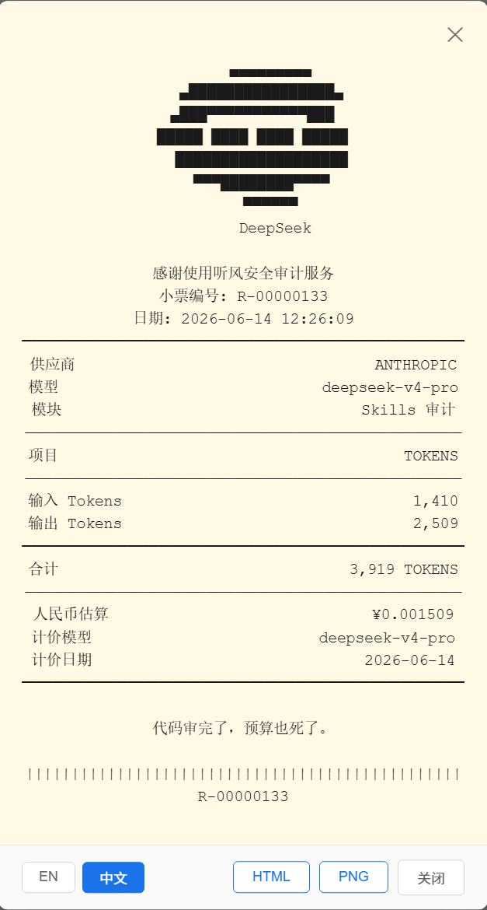
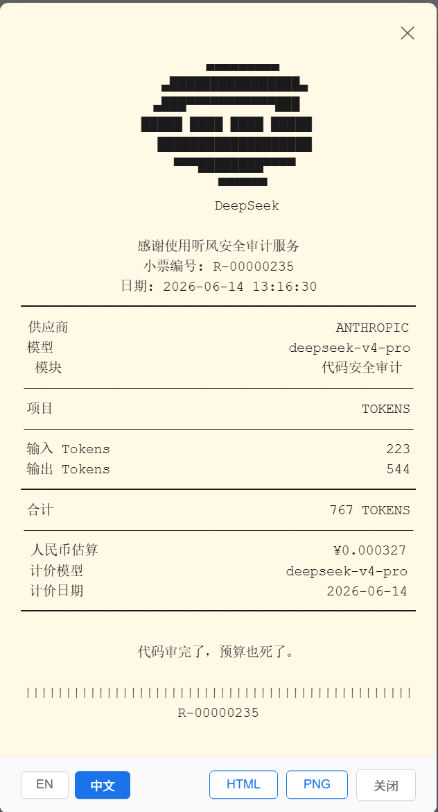

# 听风 - AI 安全评估平台

听风 是一款面向 AI 安全领域的全栈评估平台，集成**模型安全评测**、**MCP 风险扫描**、**代码安全审计**和 **Skills 安全审计**四大核心能力，帮助安全团队系统化地发现和修复 AI 系统中的安全风险。

## 核心功能

### 1. 模型安全评测
- 支持 TC260、通用、自定义三种测试集
- 自动化评测流程：生成 → 调用被测模型 → 判定风险 → 出具报告
- 裁判模型独立配置，支持与被测模型不同 Provider
- 14 天趋势分析与通过率统计
- 支持 Markdown / HTML / PDF 格式报告导出
- 超时时间可配置（10~600 秒，默认 90 秒）

### 2. MCP 风险扫描
- 上传项目源码，自动识别技术栈
- AI 驱动的漏洞发现与可利用性评审
- 风险评分与报告生成
- 支持 HTML / Markdown / PDF 格式报告导出
- 超时时间可配置（10~600 秒，默认 120 秒）

### 3. 代码安全审计
- 多阶段 Pipeline：预处理 → 切片 → Parser → Hunter → Validator → Reporter
- 基于 CWE 的漏洞分类与严重等级评定
- 漏洞知识库匹配与修复建议
- 支持 Markdown / HTML / PDF 格式报告导出
- 亮色精致主题 PDF 报告（封面+评分板+严重度分布+漏洞详情）
- PDF 正文首行缩进，编号列表自动拆分为每项一行
- 代码高亮与漏洞位置定位
- 超时时间可配置（10~600 秒，默认 90 秒）

### 4. Skills 安全审计
- AI Agent 技能安全审计，评估模型工具调用能力的安全性
- 10 个专业化 Agent 覆盖 20 种风险类型（正则扫描 + LLM 双重验证）
- 多维度风险评估：注入攻击、越权操作、信息泄露等
- 风险评分与等级评定
- 支持 Markdown / HTML / PDF 格式报告导出
- PDF 正文首行缩进，编号列表自动拆分为每项一行
- 超时时间可配置（10~600 秒，默认 90 秒）

## 其他功能
- 更新日志模块，版本号动态同步（右上角版本号自动从 CHANGELOG.json 读取）
- 模型设置 4 选项卡分拆：模型评测 / MCP 评估 / 代码审计 / Skills 审计
- 系统提示词三层增强架构（全局基础 + 模块默认 + 自定义覆盖）
- 连通性测试功能

## 项目使用





### PDF报告

|  |  |
| ------------------------------------------------------------ | ------------------------------------------------------------ |
|  |  |

### Token小票

|  |    |
| ----------------------------------------------- | ---------------------------------------- |
|     |  |


## 技术栈

| 层级 | 技术 |
|------|------|
| 前端 | React 19 + TypeScript + Vite + Recharts |
| 后端 | Express 5 + TypeScript (NodeNext) |
| 数据库 | SQLite3 |
| AI 接口 | Ollama / OpenAI / Anthropic / 智谱GLM |
| PDF 生成 | PDFKit + 多字体体系（宋体/方正风雅宋/航天腾飞体/TNR/NotoSansMono） |
| 校验 | Zod |

## 项目结构

```
WindHear/
├── src/                      # 前端源码
│   ├── pages/                # 页面组件
│   │   ├── Dashboard.tsx     # 数据面板（趋势图、饼图、最近记录）
│   │   ├── QuickStart.tsx    # 快速引导页
│   │   ├── Arsenal.tsx       # 测试集管理（题库）
│   │   ├── Evaluations.tsx   # 模型评测列表
│   │   ├── NewEvaluation.tsx # 新建模型评测
│   │   ├── EvaluationReport.tsx  # 模型评测报告
│   │   ├── EvaluationCenter.tsx  # 评估管理中心
│   │   ├── McpScans.tsx      # MCP 扫描列表
│   │   ├── NewMcpScan.tsx    # 新建 MCP 扫描
│   │   ├── McpScanReport.tsx # MCP 扫描报告
│   │   ├── CodeAuditList.tsx # 代码安全审计列表
│   │   ├── NewCodeAudit.tsx  # 新建代码安全审计
│   │   ├── CodeAuditDetail.tsx  # 审计详情与漏洞列表
│   │   ├── SkillsAuditList.tsx  # Skills 审计列表
│   │   ├── NewSkillsAudit.tsx   # 新建 Skills 审计
│   │   ├── SkillsAuditDetail.tsx # Skills 审计详情
│   │   ├── ModelSettings.tsx # 模型连接配置（4 选项卡）
│   │   └── Changelog.tsx     # 更新日志
│   ├── layout/               # 布局与导航
│   ├── components/           # 公共组件
│   ├── api.ts                # API 请求封装
│   └── types.ts              # TypeScript 类型定义
├── server/                   # 后端源码
│   ├── index.ts              # Express 路由与 API 入口
│   ├── db.ts                 # SQLite 数据库初始化与迁移
│   ├── modelClients.ts       # 多 LLM Provider 适配（Ollama/OpenAI/Anthropic/智谱GLM）
│   ├── pdfCommon.ts          # PDF 公共模块（字体注册/页眉页脚/正文渲染/代码块/表格/统一文件名）
│   ├── runner.ts             # 模型评测执行引擎
│   ├── mcpScanner.ts         # MCP 扫描编排
│   ├── mcpScanStore.ts       # MCP 扫描数据持久化
│   ├── mcpScan/              # MCP 扫描子模块
│   │   ├── pdfReport.ts      # PDF 报告生成
│   │   ├── stages/           # 分析、审计、评审、报告阶段
│   │   └── util/             # 文件遍历、LLM 适配、项目识别等工具
│   ├── codeAudit/            # 代码安全审计子模块
│   │   ├── pipeline.ts       # 审计流水线编排
│   │   ├── preprocessor.ts   # 项目预处理与代码切片
│   │   ├── slicer.ts         # 智能代码分块
│   │   ├── agents.ts         # AI Agent（Parser/Hunter/Validator/Reporter）
│   │   ├── pdfReport.ts      # PDF 报告生成（漏洞详情）
│   │   ├── evalPdfReport.ts  # PDF 报告生成（模型评估）
│   │   └── types.ts          # 审计类型定义
│   ├── codeAuditStore.ts     # 代码安全审计数据持久化
│   ├── skillsAudit/          # Skills 安全审计子模块
│   │   ├── pipeline.ts       # 审计流水线编排
│   │   ├── agents.ts         # AI Agent 集群（10个专业化Agent）
│   │   ├── pdfReport.ts      # PDF 报告生成
│   │   ├── stages/           # 正则扫描阶段
│   │   └── types.ts          # 审计类型定义
│   ├── skillsAuditStore.ts   # Skills 审计数据持久化
│   └── fonts/                # 中英文字体（宋体/风雅宋/航天腾飞体/TNR/NotoSansMono等）
├── data/                     # SQLite 数据库文件
├── img/                      # 截图与文档图片
├── CHANGELOG.json            # 更新日志数据（版本号唯一数据源）
└── public/                   # 静态资源
```

## 快速开始

### 环境要求

- Node.js >= 18
- npm >= 9
- 至少一个 LLM 服务（Ollama / OpenAI API / Anthropic API / 智谱GLM）

### 安装与启动

```bash
# 克隆项目
git clone <repo-url>
cd WindHear

# 安装依赖
npm install

# 开发模式（前端 + 后端同时启动）
npm run dev
```

前端默认运行在 `http://localhost:5173`，后端 API 运行在 `http://localhost:3001`，Vite 自动代理 `/api` 请求。

### 模型配置

启动后在 **模型设置** 页面配置 LLM 连接，4 个独立选项卡：

- **Ollama**: 填写 baseUrl（如 `http://localhost:11434`），选择模型
- **OpenAI**: 填写 baseUrl + API Key + 模型名
- **Anthropic**: 填写 API Key + 模型名
- **智谱GLM**: 填写 baseUrl（默认 `https://open.bigmodel.cn/api/paas`）+ API Key + 模型名（glm-4-flash / glm-4.7 等）

每个选项卡均可配置：
- 超时时间（10~600 秒）
- 系统提示词（三层增强：全局基础 + 模块默认 + 自定义覆盖）
- 连通性测试

## 构建与部署

```bash
# 构建前端 + 后端
npm run build

# 启动生产 API 服务
npm run start:api
```

- 前端产物输出到 `dist/`
- 后端产物输出到 `server-dist/`
- 数据库文件位于 `data/tingfeng.db`

## 开发脚本

| 命令 | 说明 |
|------|------|
| `npm run dev` | 同时启动前端和后端开发服务 |
| `npm run dev:web` | 仅启动前端 |
| `npm run dev:api` | 仅启动后端 |
| `npm run build` | 构建前后端 |
| `npm run build:web` | 仅构建前端 |
| `npm run build:api` | 仅构建后端 |
| `npm run lint` | ESLint 检查 |
| `npm run start:api` | 启动生产 API 服务 |

## 许可证

GNU Affero General Public License v3.0 (AGPL-3.0)